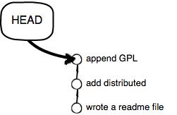

每当文件修改到一定程度时，就会保存一个“快照”，这个”快照“在Git中被称作为一个`commit`，一旦文件改错了，还可以从最近的一个commit恢复，然后继续操作。

***

|git log 提交日制查看
---
```
    qidai@qidai-linux-pc:/usr/data/git$ git log
        commit 401a64762d730b6c24d199557a2ccb2769a91c2b (HEAD -> master)
        Author: qidai <975442464@qq.com>
        Date:   Sat Jun 9 10:01:07 2018 +0800

          1

        commit 6c5fb755a94ceb603ed457c961f423430417f4bb
        Author: qidai <975442464@qq.com>
        Date:   Sat Jun 9 07:51:42 2018 +0800

          啦啦啦啦啦0
    qidai@qidai-linux-pc:/usr/data/git$
```
- 由上到下，是从最近提交到最先提交的顺序
  |- - pretty=oneline
  ---
  日制的简化输出形式
  ```
    qidai@qidai-linux-pc:/usr/data/git$ git log --pretty=oneline
        401a64762d730b6c24d199557a2ccb2769a91c2b (HEAD -> master) 1
        6c5fb755a94ceb603ed457c961f423430417f4bb 啦啦啦啦啦0
    qidai@qidai-linux-pc:/usr/data/git$

  ```
  |- - oneline
  ---
  ```
    qidai@qidai-linux-pc:/usr/data/git$ git log --oneline
        401a647 (HEAD -> master) 1
        6c5fb75 啦啦啦啦啦0
    qidai@qidai-linux-pc:/usr/data/git$
  ```
  |reflog
  ---
  ```
    qidai@qidai-linux-pc:/usr/data/git$ git reflog
        401a647 (HEAD -> master) HEAD@{0}: commit: 1
        6c5fb75 HEAD@{1}: reset: moving to 6c5fb755a94ceb603ed457c961f423430417f4bb
        6c5fb75 HEAD@{2}: reset: moving to 6c5fb75
        02a8786 HEAD@{3}: commit: dsds
        6c5fb75 HEAD@{4}: reset: moving to 6c5fb75
        e7f4e6f HEAD@{5}: commit: 1
        6c5fb75 HEAD@{6}: commit (initial): 啦啦啦啦啦0
    qidai@qidai-linux-pc:/usr/data/git$
  ```
***
当回退版本的时候，Git必须知道你要回退到哪个版本。在Git中，用`HEAD`表示版本，上一个版本是`HEAD^`，上上个版本是`HEAD^^`。当然如果是100个版本之前那就是100个`^`。可以用`HEAD~100`表示。

版本回退
---
```
    qidai@qidai-linux-pc:/usr/data/git$ git reflog
        401a647 (HEAD -> master) HEAD@{0}: commit: 1
        6c5fb75 HEAD@{1}: reset: moving to 6c5fb755a94ceb603ed457c961f423430417f4bb
        6c5fb75 HEAD@{2}: reset: moving to 6c5fb75
        02a8786 HEAD@{3}: commit: dsds
        6c5fb75 HEAD@{4}: reset: moving to 6c5fb75
        e7f4e6f HEAD@{5}: commit: 1
        6c5fb75 HEAD@{6}: commit (initial): 啦啦啦啦啦0
    qidai@qidai-linux-pc:/usr/data/git$ cat a
        123
        123123
        1231sdad
    qidai@qidai-linux-pc:/usr/data/git$ git reset --hard 6c5fb75
        HEAD 现在位于 6c5fb75 啦啦啦啦啦0
    qidai@qidai-linux-pc:/usr/data/git$ cat a
        123
    qidai@qidai-linux-pc:/usr/data/git$
```
- 这时候查看日志已经不见了之前的操作
```
    qidai@qidai-linux-pc:/usr/data/git$ git log
        commit 6c5fb755a94ceb603ed457c961f423430417f4bb (HEAD -> master)
        Author: qidai <975442464@qq.com>
        Date:   Sat Jun 9 07:51:42 2018 +0800

          啦啦啦啦啦0
    qidai@qidai-linux-pc:/usr/data/git$
```
- 但是如果我们还是想回去的话，只要本次的窗口没有关掉，那么我们就可以继续使用类似上面版本回退的指令的`commit id`即可。
```
    qidai@qidai-linux-pc:/usr/data/git$ git reset --hard 401a647
        HEAD 现在位于 401a647 1
    qidai@qidai-linux-pc:/usr/data/git$ cat a
        123
        123123
        1231sdad
    qidai@qidai-linux-pc:/usr/data/git$
```
- 如果是一时手快关闭了窗口咋办呢，那么我们可以使用上述的`git reflog`查看`commit id`即可。这里需要注意的是，操作git必须在git的init仓库下进行命令操作、
***

Git版本回退很快，因为它内部又一个`HEAD`指针。当回退版本时，GIt只是把指针指向原来的版本就可以了。

