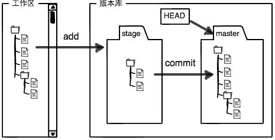

工作区(Working Directory)
---
就是电脑上能看到的目录。

版本库(Repository)
---
工作区内的`.git`/,这个不算工作区，是Git的版本库。Git版本库中放了很多东西，其中最重要的就是称为`stage`的暂存区，还有Git自动创建的第一个分支`master`，以及指向`master`的一个指针`HEAD`。


***
####之前的工作区状态
```
    qidai@qidai-linux-pc:/usr/data/git$ git status
    位于分支 master
    无文件要提交，干净的工作区
```
####进行文件的添加和修改
```
    qidai@qidai-linux-pc:/usr/data/git$ ls
    a
    qidai@qidai-linux-pc:/usr/data/git$ echo 123313121 >b
    qidai@qidai-linux-pc:/usr/data/git$ echo 123313121 >> a
```
####修改过后查看状态
```
    qidai@qidai-linux-pc:/usr/data/git$ git status
      位于分支 master
      尚未暂存以备提交的变更：
        （使用 "git add <文件>..." 更新要提交的内容）
        （使用 "git checkout -- <文件>..." 丢弃工作区的改动）

      	修改：     a

      未跟踪的文件:
        （使用 "git add <文件>..." 以包含要提交的内容）

      	b

      修改尚未加入提交（使用 "git add" 和/或 "git commit -a"）
```
####将更改添加到暂存区
```
    qidai@qidai-linux-pc:/usr/data/git$ git add a
    qidai@qidai-linux-pc:/usr/data/git$ git add b
```
####获取状态
```
    qidai@qidai-linux-pc:/usr/data/git$ git status
      位于分支 master
      要提交的变更：
        （使用 "git reset HEAD <文件>..." 以取消暂存）

      	修改：     a
      	新文件：   b
```
####提交暂存区的文件改动到仓库
```
    qidai@qidai-linux-pc:/usr/data/git$ git commit -m "change a  add b"
      [master 3781aaa] change a  add b
       2 files changed, 2 insertions(+)
       create mode 100644 b
```
####再次查询的状态
```
    qidai@qidai-linux-pc:/usr/data/git$ git status
      位于分支 master
      无文件要提交，干净的工作区
```
