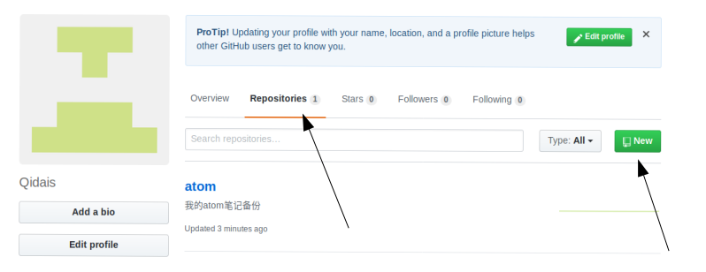
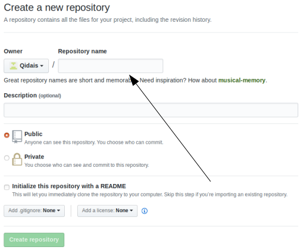

为本地Git版本库添加一个远程GitHub库
***

按照箭头所示，点击`Repositonies`，然后点击`new`


输入项目名点击下面`create repository`即可

***
- 之后就会产生一个`HTTPS`和`SSH`的链接地址，拷贝下来，用作添加远程库使用
- 在本地库上执行`git remote add atomOrigin git@github.com:Qidais/atom.git`即可添加远程库。
- 如果提示
```
    The authenticity of host 'github.com (13.229.188.59)' can't be established.
    RSA key fingerprint is SHA256:nThbg6kXUpJWGl7E1IGOCspRomTxdCARLviKw6E5SY8.
    Are you sure you want to continue connecting (yes/no)?
    Host key verification failed.
    fatal: 无法读取远程仓库。

    请确认您有正确的访问权限并且仓库存在。
```
可能是因为GitHub上并没有本机的公匙，点击`https://github.com/settings/ssh `，在页面中添加自己的公匙就可以了，钥匙生成命令`ssh-keygen -t rsa -C **@qq.com`

***
- 添加完之后，来进行本地版本库与远程版本库的同步操作`git push -u atomOrigin master`
  - `-u`参数不但会把本地的master分支内容推送到远程新的master分支上，还会把本地的master分支和远程的master分支关联起来，以后推送直接使用`git push atomOrigin master`即可。
