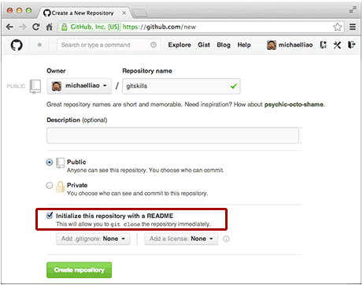
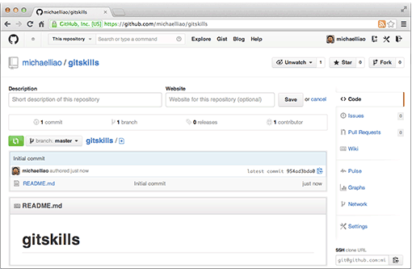

####创建一个GitHub仓库，名字为gitskills


####勾选`Initialize this repository with a README`，这样Github会自动的创建一个`README.md`文件，创建完后可以看到

####现在远程库已经弄好了，下面是克隆一个本地库下来
```
    $ git clone git@github.com:michaelliao/gitskills.git
    Cloning into 'gitskills'...
    remote: Counting objects: 3, done.
    remote: Total 3 (delta 0), reused 0 (delta 0), pack-reused 3
    Receiving objects: 100% (3/3), done.
```

####然后进入自己的本地库，查看已经有了一个README.md文件
