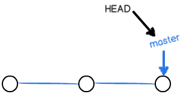
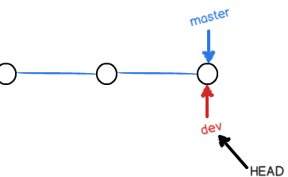
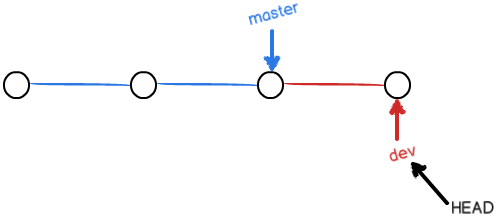
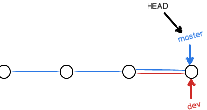
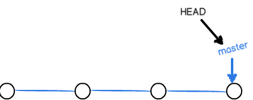
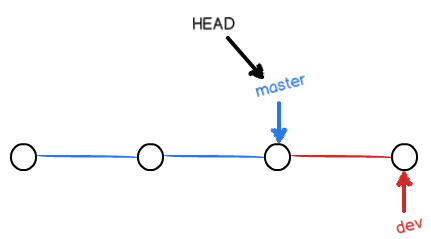

每次提交，Git都会把他们串成一条时间线，这条时间线就是一个分支，截至目前，只有一个分支，就是`master`分支。`HEAD`并不是指向提交的，而是指向`master`，`master`才是指向提交的，所以`HEAD`指向当前分支。

  一开始的时候，`master`分支是一条线，Git用`master`指向最新提交，再用`HEAD`指向master，就能确定当前分支的提交点。


- 每次提交，`master`分支都会向前移动一步，随着不断的提交，`master`分支越来越长。

***
当创建了新的分支`dev`时，指向`master`相同的提交，再把`HEAD`指向`dev`，就表示当前分支在dev上了。


Git创建一个分支很快，增加一个`dev`指针，更改`HEAD`的指向就可以了，并没有修改工作区的文件。
不过从现在开始，对工作区的修改和提交就是针对`dev`指针了，比如新提交一次后，`dev`向前移动，而`master`不变、


加入在`dev`上的工作完成了，就可以把`dev`合并到master上，最简单的合并方法就是直接把`master`指向`dev`的当前提交，就完成了合并。



合并完成后，可以选择删除`dev`分支，删除`dev`分支就是将`dev`指针删掉了。


***
####查看之前的状态
```
    qidai@qidai-linux-pc:/usr/data/git$ git status
        位于分支 master
        无文件要提交，干净的工作区
    qidai@qidai-linux-pc:/usr/data/git$ git reflog
        e7c79a2 (HEAD -> master, atomOrigin/master) HEAD@{0}: commit: 2
        fe4268d HEAD@{1}: checkout: moving from fe4268d2f204fc40d3b150345274d27d0da0ab12 to master
        fe4268d HEAD@{2}: commit (merge): 1
        dc10840 HEAD@{3}: commit: d
        ef1b62d HEAD@{4}: reset: moving to ef1b62d
        54074fb HEAD@{5}: commit: delete t
        ef1b62d HEAD@{6}: commit: add t
        401a647 HEAD@{7}: reset: moving to HEAD^
        3781aaa HEAD@{8}: checkout: moving from master to HEAD^
        f8aba98 HEAD@{9}: reset: moving to f8aba98
        9bdaca7 HEAD@{10}: commit: c delete
```
####创建新分支`dev`
```
qidai@qidai-linux-pc:/usr/data/git$ git checkout -b dev
    切换到一个新分支 'dev'
```
- 上面的`-b`参数就相当于创建分支，并切换到新创建的分支,相当与以下两条命令
  ```
  git branch dev
  git checkout dev
  ```
####查看当前处于的分支
```
qidai@qidai-linux-pc:/usr/data/git$ git branch
    * dev
      master
```
  - 命令会列出分支，并显示一个`*`号在目前位于分支的前面。

###查看工作空间以及创建提交文件
```
    qidai@qidai-linux-pc:/usr/data/git$ ls
    qidai@qidai-linux-pc:/usr/data/git$ echo a > a
    qidai@qidai-linux-pc:/usr/data/git$ git add a
    qidai@qidai-linux-pc:/usr/data/git$ git commit -m "add a"
        [dev 341d6a8] add a
         1 file changed, 1 insertion(+)
         create mode 100644 a
    qidai@qidai-linux-pc:/usr/data/git$ git reflog
        341d6a8 (HEAD -> dev) HEAD@{0}: commit: add a
        e7c79a2 (atomOrigin/master, master) HEAD@{1}: checkout: moving from master to dev
        e7c79a2 (atomOrigin/master, master) HEAD@{2}: commit: 2
        fe4268d HEAD@{3}: checkout: moving from fe4268d2f204fc40d3b150345274d27d0da0ab12 to master
        fe4268d HEAD@{4}: commit (merge): 1
        dc10840 HEAD@{5}: commit: d
        ef1b62d HEAD@{6}: reset: moving to ef1b62d
```
####切换回`master`分支
```
    qidai@qidai-linux-pc:/usr/data/git$ git checkout master
      切换到分支 'master'
    qidai@qidai-linux-pc:/usr/data/git$ ls
```
  - 可以看到切换回来之后，在`dev`分支上创建的文件已经消失不见了。因为那个提交是在`dev`上，而`master`分支此刻的提交点并没有变。



####合并`dev`到`master`分支上
```
    qidai@qidai-linux-pc:/usr/data/git$ git merge dev
        更新 e7c79a2..341d6a8
        Fast-forward
         a | 1 +
         1 file changed, 1 insertion(+)
         create mode 100644 a
    qidai@qidai-linux-pc:/usr/data/git$ ls
        a
```
  - 注意到上面的`Fast-forward`，这是`快进模式`，也就是直接把`master`指向`dev`的提交，所以合并速度很快。但是并不是每次都能`Fast-forward`。

####合并完成后删除分支
```
    qidai@qidai-linux-pc:/usr/data/git$ git branch -d dev
        已删除分支 dev（曾为 341d6a8）。  
```

***
##小结
- 查看分支`git branch`
- 创建分支`git branch name`
- 切换分支`git checkout name`
- 创建+切换分支`git checkout -b name`
- 合并某个分支到 当前分支`git merge name`
- 删除分支`git branch -d name`
