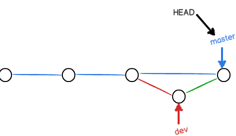
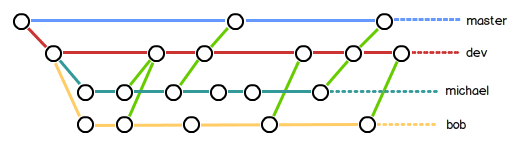

在合并分支时。Git会用`Fast forward`模式，但是在这种情况下，删除分之后，会对掉分支信息。如果要强制禁用`Fast forward`模式。Git就会在`merge`时生成一个新的`commit`，这样，从分支历史上就可以看出分支信息。
***
创建`dev`分支并提交
```
    qidai@qidai-linux-pc:/usr/data/git$ git checkout -b dev
        切换到一个新分支 'dev'
    qidai@qidai-linux-pc:/usr/data/git$ echo test > test
    qidai@qidai-linux-pc:/usr/data/git$ git add test
    qidai@qidai-linux-pc:/usr/data/git$ git commit -m "dev add test"
        [dev 2a481af] dev add test
         1 file changed, 1 insertion(+)
         create mode 100644 test
    qidai@qidai-linux-pc:/usr/data/git$
```

返回`master`分支
```
git checkout master
```

准备合并`dev`分支，并添加`--no-ff`参数，表示禁用`Fast forward`
```
    qidai@qidai-linux-pc:/usr/data/git$ git checkout master
        切换到分支 'master'
    qidai@qidai-linux-pc:/usr/data/git$ git merge --no-ff -m "merge dev add test" dev
        Merge made by the 'recursive' strategy.
         test | 1 +
         1 file changed, 1 insertion(+)
         create mode 100644 test
```

查看日志信息
```
    qidai@qidai-linux-pc:/usr/data/git$ git log --graph --pretty=oneline --abbrev-commit
        *   f67b077 (HEAD -> master) merge dev add test
        |\  
        | * 2a481af (dev) dev add test
        |/  
        *   a050e24 Merge branch 'dev'
        |\  
        | * cf75448 dev add b
        * | 9a29e76 delete b
        * | 7880845 add bbbbbbbbbbbbbbbb
        * |   a980af0 1123123123
        |\ \  
        | |/  
        | * 7ec7e86 add as
        |/  
        * c6c4340 delete all
        *   0a20c44 Merge branch 'dev'
```
`merge` 之后就是这样


***
##分支策略

- 在实际开发中，`master`分支应该是非常稳定的，也就是仅用来发布新版本的，平时不能在上面干活。

- 干活一般都在`master`另一个分支上工作，到时候开发完毕，直接合并到`master`分支上即可。

- 多人可以在`dev`分支上继续创建分支。到时候每个人往`dev`分支上合并就可以了。


