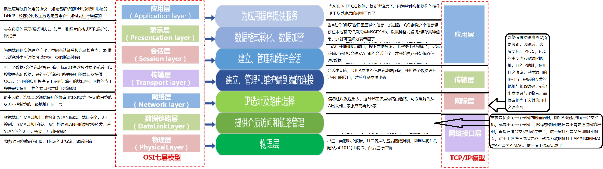
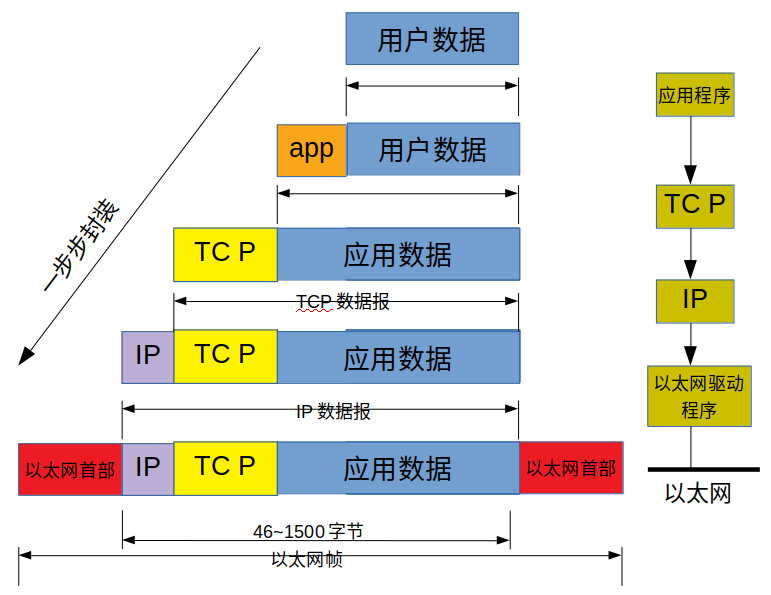

分层
---
|分四层
---
- 链路层：设备驱动程序及接口卡  ：处理与电缆的屋里接口细节
- 网络层：IP：ICMP，IGMP      ：处理分组在网络中的活动，例如分组选路
- 运输层：TCP.UDP           ：为两台主机上的应用程序提供端到端的通讯
- 应用层：Telnet，FTP，e-mail：处理特定的应用程序细节

|分七层
---

互联网的地址
---
- IP地址的分类：A，B，C，D，E
- 有三类的IP地址：单播地址，广播地址，多播地址
- A类，B类，C类这三类地址用于TCP/IP节点。其他两类用于特殊用途。
- A,B,C类的IP地址的特点：当将IP地址写成二进制形式时，A类地址的第一位总是0，B类地址的前两位总是10，C类地址的前三位总是110、

|A类地址
---
- A类地址第一字节位网络地址，其他三个字节为主机地址。
- A类地址范围：1.0.0.1 ～ 126.155.255.254
- A类地址中的私有地址和保留地址：
  - 10.x.x.x是私有地址(在局域网络中的地址)
  - 127.x.x.x是保留地址，用于循环测试用的
- 缺省子掩码：255.0.0.0

|B类地址
---
- B类地址第一字节和第二字节为网络地址，其他2字节为主机地址
- B类地址范围：128.0.0.1 ~ 191.255.255.254
- B类地址的私有地址和保留地址
  -  172.16.0.0 ~ 172.37.255.255是私有地址
  -  169.254.x.x是保留地址。如果你的IP地址是自动获取IP地址，而你在网络上又没有找到可用的DHCP服务器，就会得到其中一个IP
- 缺省子掩码：255.255.0.0
- **DHCP**:动态主机配置协议，主要作用是集中的管理分配IP地址，使网络环境中的主机动态的获得IP地址，Gateway地址，DNS服务器地址信息等。

|C类地址
---
- C类地址的前三个字节为网络地址，第四个字节为主机地址，另外第一个字节的前三位固定为110
- C类地址范围：192.0.0.1 ～ 223.255.255.254
- C类地址中的私有地址  :  192.168.x.x是私有地址
- 缺省子掩码：255.255.255.0

|D类地址
---
- D类地址不分网络和主机地址，它的第一个字节的前四位固定为1110
- D类地址范围：224.0.0.1 ～ 239.255.255.254

|E类地址
---
- E类地址不分网络地址和主机地址，第一个字节的前五位固定为11110
- E类地址范围：240.0.0.1 ~ 255.255.255.254

封装
---
以太网数据帧的物理特性是其长度必须字啊46到1500字节之间。

端口号
---
计算机的端口号 0~65535个，其中0~1024是系统保留端口，使用可使用之后的端口号，避免冲突。
