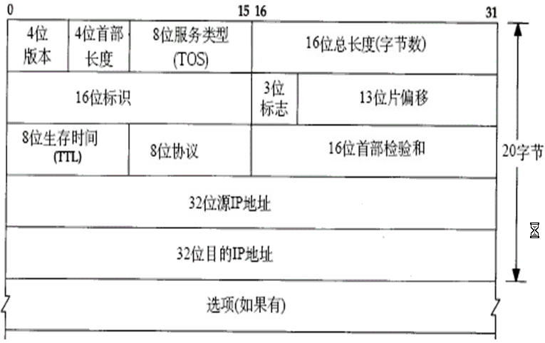

引言
---
- IP是TCP/IP协议族中最为核心的协议，所有的TCP，UDP，ICMP及IGMP数据都以IP数据报格式传输。
IP提供不可靠，和无连接的数据报传送服务
- 不可靠的意思是它不能保证IP数据报能成功的到达目的地。IP仅提供最高的传输服务，如果发送某种错误时，如某个路由器暂时用完了缓冲区，IP有一个简单的错误处理算法：丢弃该数据报，然后发送ICMP消息报给信源端。任何要求的可靠性必须由上层来提供。
- 无连接IP并不维护任何关于后续数据报的状态信息。每个数据报的处理是相互独立的，IP数据包可以不按顺序接收。

IP首部
---
   
