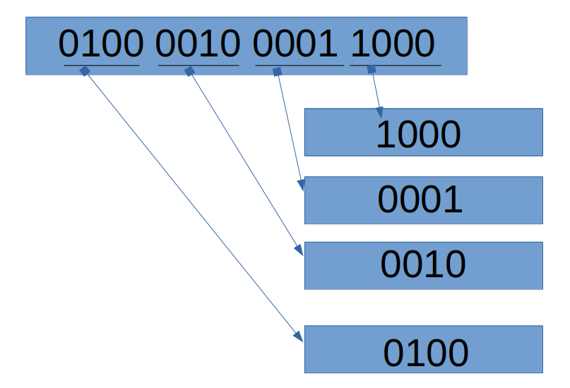

归档就是把一些文件按照一定的规则统一写入一个文件中，类似与全选目录下所有文件，进行集体压缩，集体压缩的时候，需要
按照一定的规则，因此在解档的时候，就会按照此规则进行解档。

  ####规则
      文件名长度+文件名+文件内容长度+文件内容

  ####测试
      将104这个int值写入byte数组，再将byte数组合并起来，再次写出104
  ####代码实现
      ```
      public class Test11 {
          public static void main(String[] args) {
              byte[] bytes = intToByte(-255);
              int i = byteToInt(bytes);
              System.out.println(i);
          }
          //2 = 0000 0000 0000 0010
          public static byte[] intToByte(int num){
              byte[] bytes = new byte[4];
              bytes[0] = (byte)num;
              bytes[1] = (byte)(num >> 8);
              bytes[2] = (byte)(num >> 16);
              bytes[3] = (byte)(num >> 24);
              //这里为什么是按照 8 16 24 位移呢？ 因为一个字节是8位0101。
              return bytes;
          }
          //0001 0010 0100 1000
          //分成如下四块，如下四块移位后是对应后面的二进制位
          //0001 << 0001 0000 0000 0000
          //0010 << 0000 0010 0000 0000
          //0100 << 0000 0000 0100 0000
          //1000 << 0000 0000 0000 1000
          //然后相加就好了，也就是或运算
          public static int byteToInt(byte[] bytes){
              //会自动转换为int
              //int i0 = 00000000 00000000 00000000 bytes[0]
              int i0 = bytes[0]  & 0xFF;
              //int i1 = 00000000 00000000 byte[1] 00000000
              int i1 = (bytes[1] & 0xFF) << 8;
              //int i2 = 00000000 byte[2] 00000000 00000000
              int i2 = (bytes[2] & 0xFF) << 16;
              //int i3 = byte[3] 00000000 00000000 00000000
              int i3 = (bytes[3] & 0xFF) << 24;
              return i0 | i1 |i2 |i3;

              /**
               * 这里为什么是先进行了&操作而后才进行位移运算？
               *      因为如果是负数的话,在进行位运算符时，byte会自动转换成int
               *      也就是说，其他的字节会自动补全，如果是正数补0，负数补1
               *      比如 1111 1010  转换成int二进制为  11111111 11111111 11111111 111111010
               *      在进行|运算时，1会影响计算结果，所以需要将前面自动补齐的1改变为0
               *      0xFF二进制为：1111 1111   也就是一个字节。
               *      就是把目标byte前的一个字节确保转换为0，转换后为11111111 11111111 00000000 111111010
               *      在进行左移位的时候，就不会再受影响。
               */
          }
        }
      ```
  

***
  实现了上面的操作之后，下面就开始实现文件的归档。归档的规则按照刚开始提到的规则执行。
  首先是用到上面的byteToInt 和 intToByte方法，这两个方法归到了一个Utils类里面了。
  ###首先是归档程序
    ```
        import java.io.ByteArrayOutputStream;
        import java.io.File;
        import java.io.FileInputStream;
        import java.io.FileOutputStream;

        public class CombinationFile {
          public static void main(String[] args) {
              try (FileOutputStream fileOutputStream = new FileOutputStream("/usr/data/test/out")) {
                  fileOutputStream.write(appendFile("/usr/data/test/a"));
                  fileOutputStream.write(appendFile("/usr/data/test/b"));
                  fileOutputStream.write(appendFile("/usr/data/test/c.jpg"));
              }catch (Exception e){
                  e.printStackTrace();
              }
          }

          public static byte[] appendFile(String path){
              File file = new File(path);
              //文件名数字长度
              byte[] fileNameLen = Utils.intToByte(file.getName().length());
              //文件名
              byte[] fileName = file.getName().getBytes();
              //内容数字长度
              byte[] fileContentLen = Utils.intToByte((int) file.length());
              byte[] bytes = new byte[(int) (4 + fileName.length + 4 + file.length())];
              System.arraycopy(fileNameLen , 0 , bytes , 0 , 4 );
              System.arraycopy(fileName , 0 , bytes , 4 , fileName.length );
              System.arraycopy(fileContentLen , 0 , bytes , 4 + fileName.length , 4 );
              ByteArrayOutputStream baos = new ByteArrayOutputStream();
              try (FileInputStream fis = new FileInputStream(file)) {
                  int contentIndex = 0;
                  byte[] content = new byte[1024];
                  while ((contentIndex = fis.read(content)) != -1){
                      baos.write(content , 0 , contentIndex );
                  }
                  byte[] contentByteArr = baos.toByteArray();
                  System.arraycopy(contentByteArr , 0 , bytes , 4 + fileName.length + 4 , contentByteArr.length);
              }catch (Exception e){
                  e.printStackTrace();
              }
              return  bytes;
          }
        }

    ```
  ###下面是对应规则的解档程序
    ```
        import java.io.FileInputStream;
        import java.io.FileNotFoundException;
        import java.io.FileOutputStream;
        import java.io.IOException;
        import java.util.ArrayList;
        import java.util.List;

        public class Solustion {
            public static void main(String[] args) {
                List<FileBean> files = new ArrayList<>();
                FileBean bean;
                try (FileInputStream fileInputStream = new FileInputStream("/usr/data/test/out")) {
                    while ((bean = readNextFile(fileInputStream)) != null){
                        files.add(bean);
                    }
                }catch (Exception e){
                    e.printStackTrace();
                }

                files.forEach((file) -> {
                    System.out.println("遇到 " + file.getFileName() + " 文件。正在处理");
                    try {
                        FileOutputStream fos = new FileOutputStream("/usr/data/test/un/"+file.getFileName());
                        fos.write(file.getFileContent());
                        fos.close();
                    } catch (Exception e) {
                        e.printStackTrace();
                    }
                });
            }

            public static FileBean readNextFile(FileInputStream fis) throws IOException {
                byte[] fileNameByteLen = new byte[4];
                int jugde = fis.read(fileNameByteLen);
                if (jugde == -1){
                    return null;
                }
                int fileNameLen = Utils.byteToInt(fileNameByteLen);
                byte[] fileNameContentByte = new byte[fileNameLen];
                fis.read(fileNameContentByte);
                String fileName = new String(fileNameContentByte);

                byte[] fileContentByteLen = new byte[4];
                fis.read(fileContentByteLen);
                int fileContentLen = Utils.byteToInt(fileContentByteLen);
                byte[] fileContentByte = new byte[fileContentLen];
                fis.read(fileContentByte);
                return new FileBean(fileName , fileContentByte);
            }
        }

    ```
***
    Debug
    --------------
    	f5		//step into ,单步进入,
    	f6		//step over	,单步跳过
    	f7		//step return 单步返回.
    	f8		//resume	,继续。
